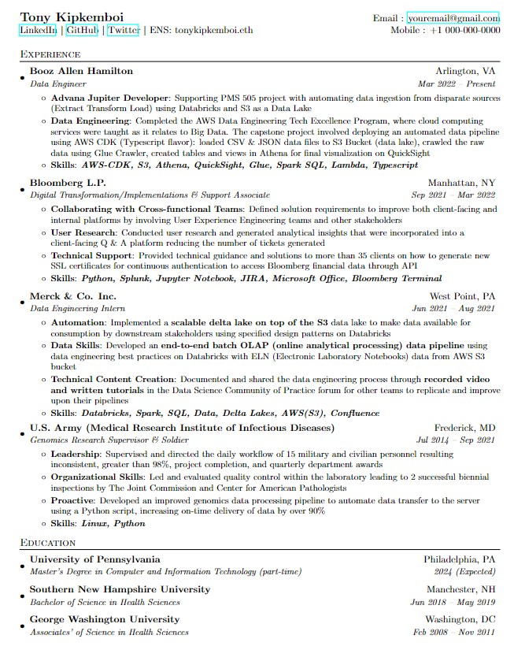

# Data Engineer LaTeX Resume

I used [Overleaf](https://www.overleaf.com/) (online LaTeX editor) to create this resume. Feel free to copy it and modify as needed.

The site also has other [resume/cv templates](https://www.overleaf.com/latex/templates/tagged/cv) that you might find inspiring.

*My Data Engineering Resume created using LaTeX*

